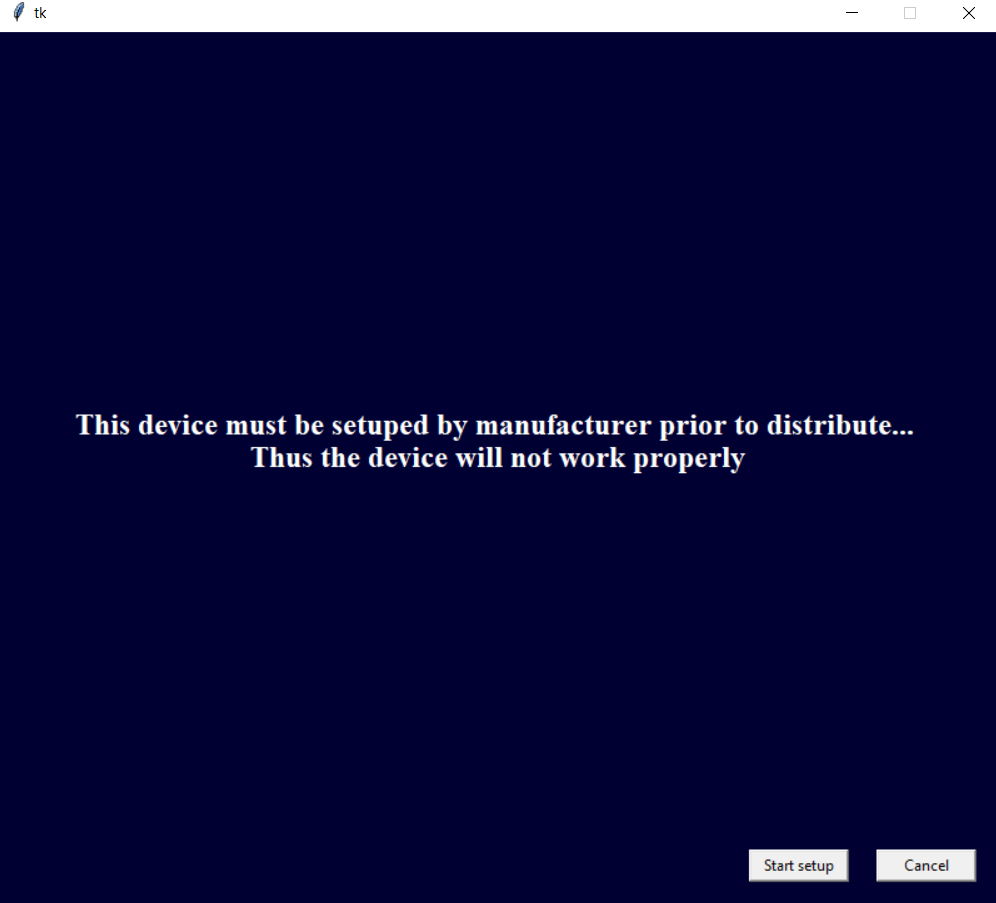
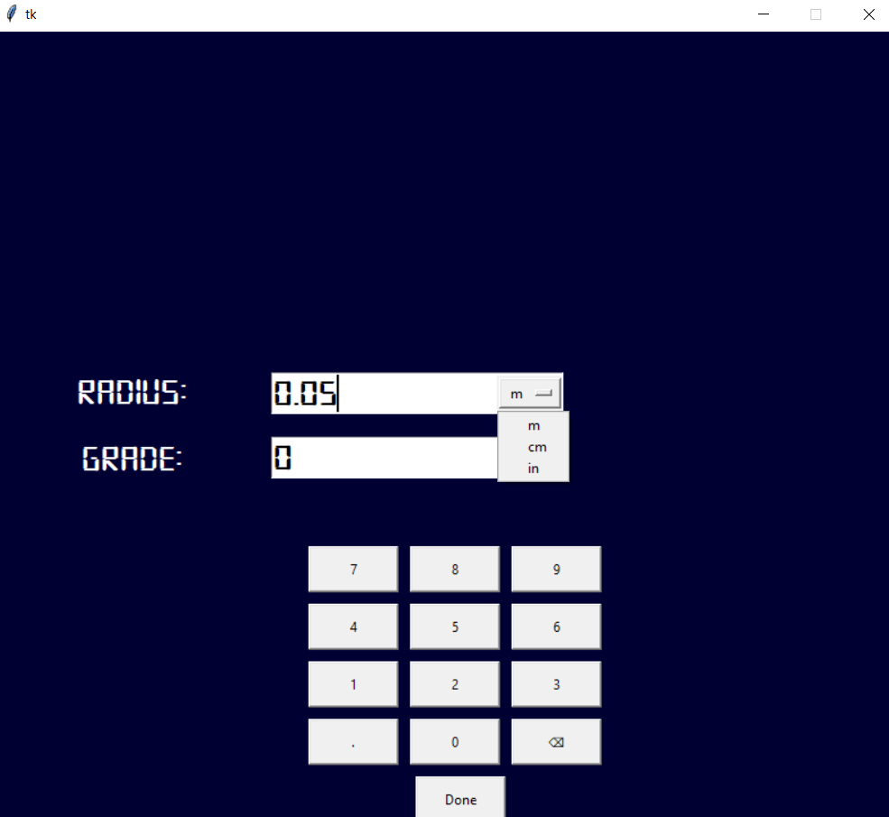
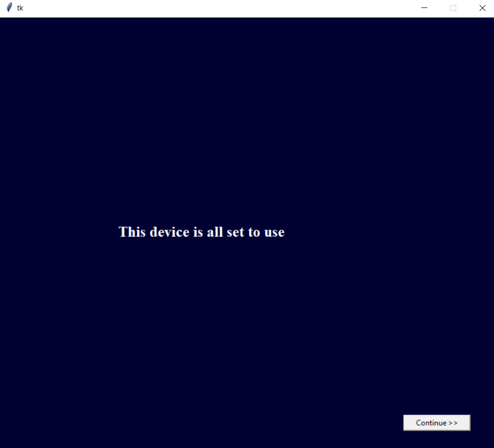
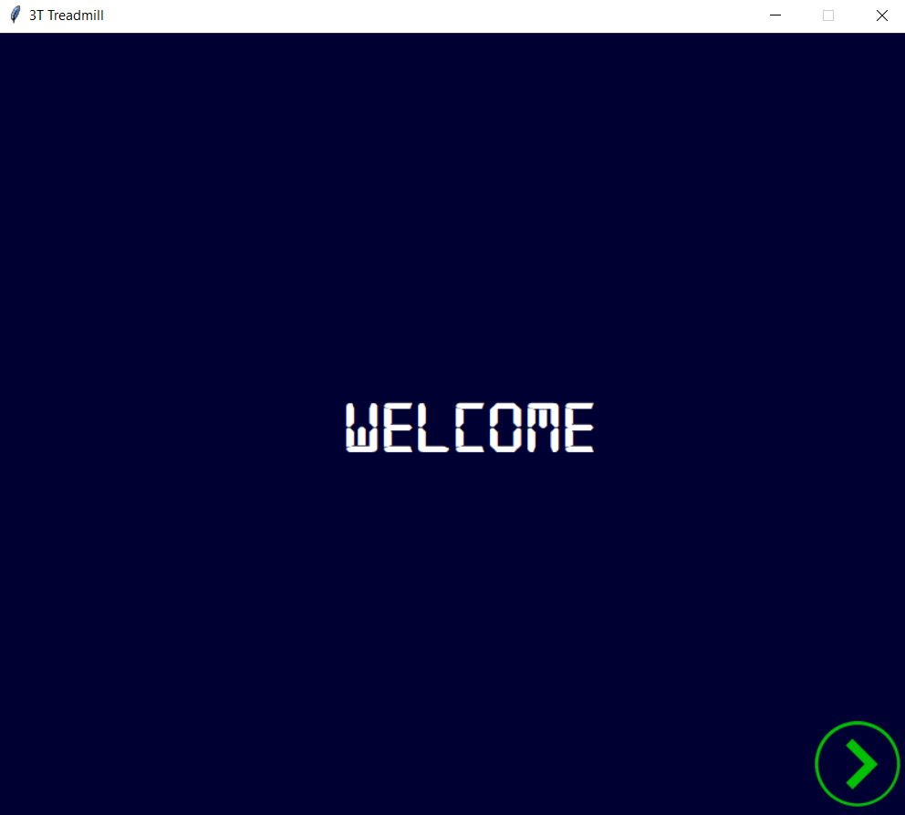
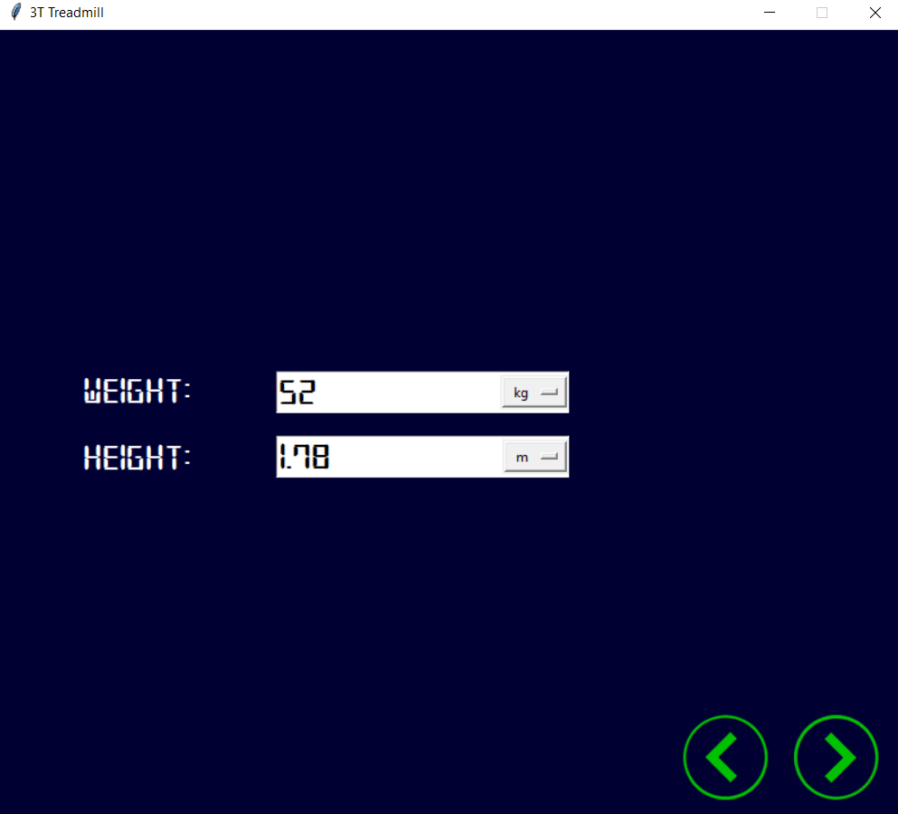
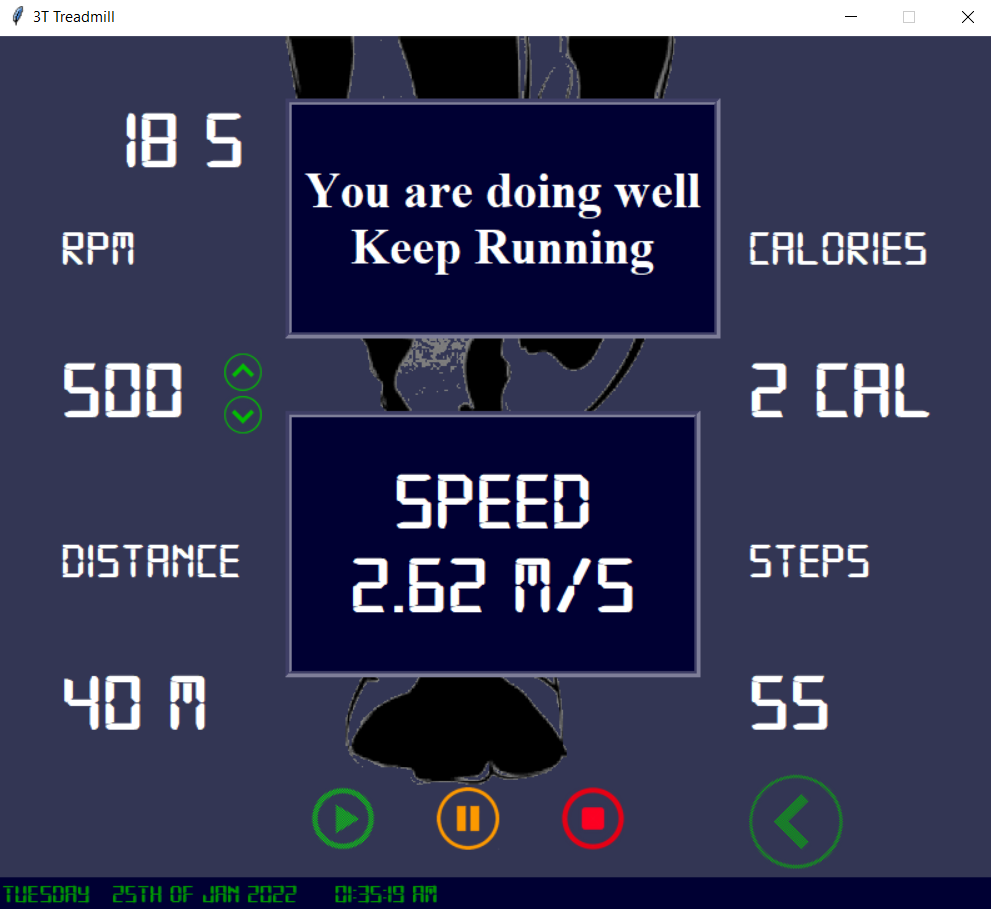

# Treadmill OS

This project was implemented for provide a Operating System and UI for a treadmill with pure <strong>Python</Strong>.
This project was implemented to remove thefts in stores when adding items to trolley, to provide the location of sections in store, and to generate automated bills that will be displayed in the app when checking out.

## Author or creator of The Operating System :

[Thanoraj Muthulingam](https://github.com/Thanoraj) 
[Thamatanthi Mahendranathan](https://github.com/ThamayanthiM) 
[Thanojan Vettivel](https://github.com/ThanojanVettivel)

## About

First we created a python script for calculations need to be done while treadmill is working. After that we started working on building UI with python. We only used python for build the UI. For building UI we used a python library called <strong>tkinter</strong>. This library helps us to create UI elements with python. 
To use this library in your local machine, you need to install this package in your local machine by running below code in terminal. 
&nbsp;&nbsp;&nbsp;&nbsp;&nbsp;&nbsp;<i>pip install tkinter</i>  

Other than this we used another library called <strong>pillow<strong>. This library helps us to import images, gifs and etc. 
To use this library in your local machine, you need to install this package in your local machine by running below code in terminal. 
&nbsp;&nbsp;&nbsp;&nbsp;&nbsp;&nbsp;<i>pip install pillow</i>  

This OS have : 
&nbsp;&nbsp;&nbsp;&nbsp;&nbsp;&nbsp;Initial Setup for radius of Motor & Grade(angle between belt and floor) 
&nbsp;&nbsp;&nbsp;&nbsp;&nbsp;&nbsp;Customize the calory output by inserting the weight and height. 
&nbsp;&nbsp;&nbsp;&nbsp;&nbsp;&nbsp;Current date and time bar 
&nbsp;&nbsp;&nbsp;&nbsp;&nbsp;&nbsp;Animated UI with speed change  

## Screenshots from the UI:

</img>
</img>
</img>
</img>
</img>
</img>
